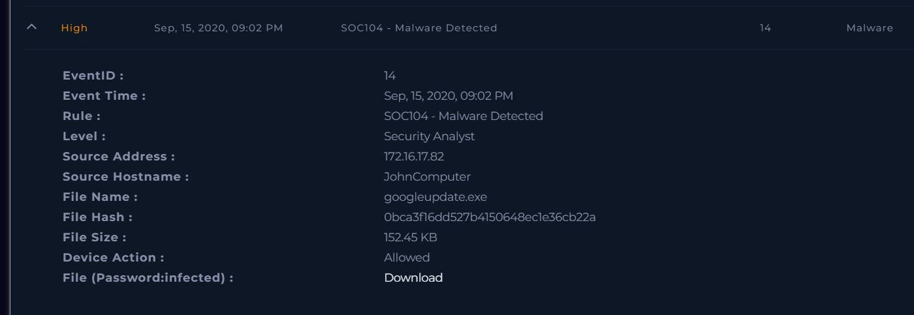
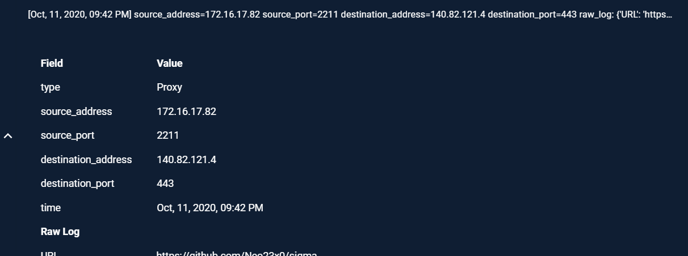
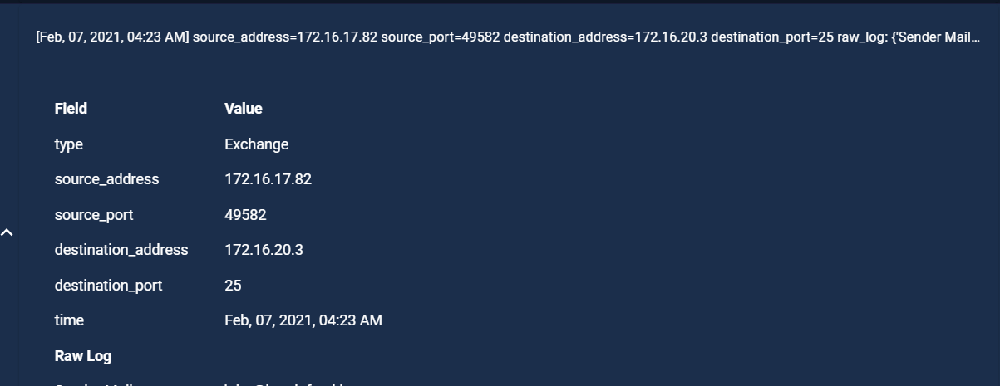
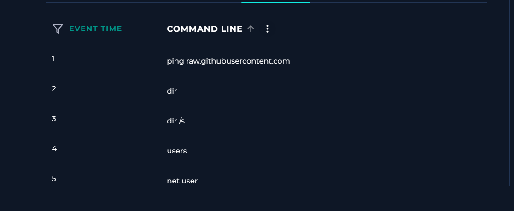
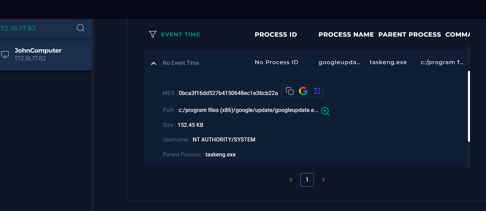
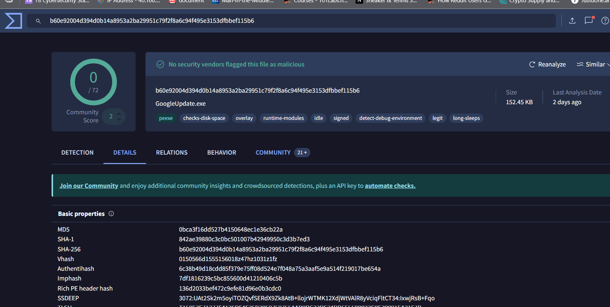
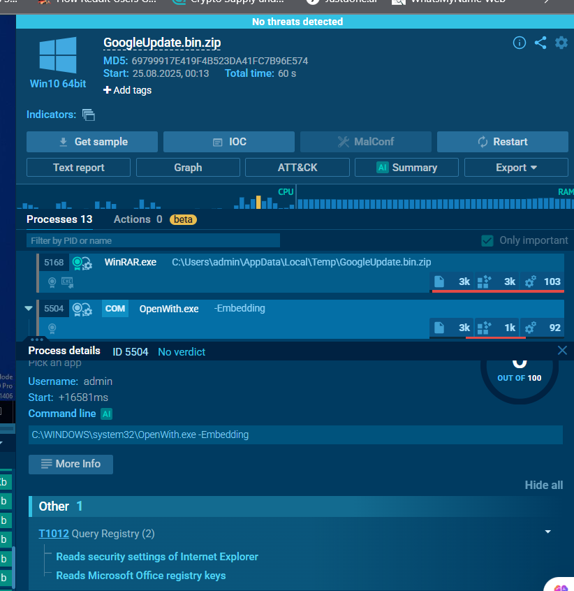
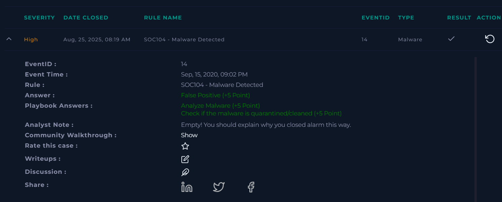

Malware Analysis :

Let’s start with the logs and endpoint security. The point is simple, if malware is active, it’ll either be reaching out to a C2 or trying to spawn shady processes..

Nothing stands out in the logs. No weird connections, no odd timestamps, nothing that screams compromise. At this point, nothing to escalate from log review alone.

Checked endpoint security through the terminal for suspicious processes — nothing unusual showed up. No rogue parent-child relationships, no persistence behavior. From a NIST 800-61 angle, this fits into the detection & analysis phase,we collected data but didn’t see indicators that push us to containment. In a SIEM workflow, this would be a “no escalation” event. For MITRE ATT&CK, we’d normally map process injection (T1055) or persistence (T1547), but neither is visible here.

Saw update.exe in the process list, but nothing suspicious tied to it. Browser history shows the user searched for it directly, so this lines up with expected behavior. No need to flag or escalate ,just normal activity.

As of now, nothing suspicious is showing up. This alert is probably a false positive. Still, to be thorough, I’d take the file hash or sample and drop it into VirusTotal or run it through ANY.RUN. If those come back clean, it’s safe to close it out. If they light up with hits or network activity, then it’s a different story.

VirusTotal came back clean ,no detections at all. To double-check, I pulled the file into ANY.RUN and ran a sandbox analysis. No suspicious network traffic, no process injection, nothing that would tie this to a C2 or lateral movement.

At this point, both the local checks and the external sandboxes confirm it’s safe. That makes this alert a false positive, and it can be closed out in the SIEM without escalation.

Nothing suspicious came up. VirusTotal and ANY.RUN both confirm the file is clean. Hence, I conclude this file shows no sign of malice and doesn’t impact the user’s system in any way. This alert can be marked as a false positive and closed out.

