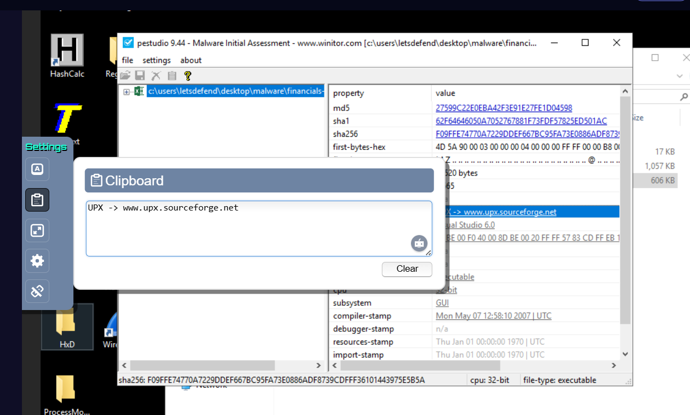
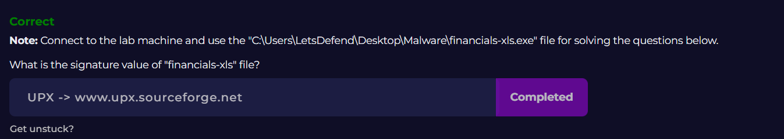

Static Document analysis challenge :

These are malware samples provided in Flare VM for analysis. One key thing I learned is that when a document is given, checking its hex values is important to deduce the actual file type or extension. For this we use the tool HxD. When you open the file in HxD, there are three main clues that stand out.

The hex values show 4D 5A (MZ) along with the string “This program cannot be run in DOS mode.” When I looked this up, these are traits of a Windows executable (.exe) file.

Second file now. First thing to check is the signature. Magic bytes expose the real format (4D 5A for EXE, D0 CF 11 E0 for old Office docs, 50 4B 03 04 for ZIP-based files). Extensions can be faked, signatures can’t.

Next is the packer/compiler. Tools like PEStudio or Exeinfo PE show if it’s UPX packed or compiled in something like Visual C++ or Delphi. That tells you if it’s obfuscated and needs unpacking.

This file matches that case, so I’ll run it in PEStudio to see what it’s built with.

Since the signature shows UPX, that means a packer is used and the file is likely packed. To analyze it properly we need to unpack it and check the real size. For this we can use Exeinfo PE.

The output shows it’s a 32-bit executable, and the second line confirms it’s packed. That means we’ll need to unpack it first before doing any deeper analysis.

As we can see the file size here .
